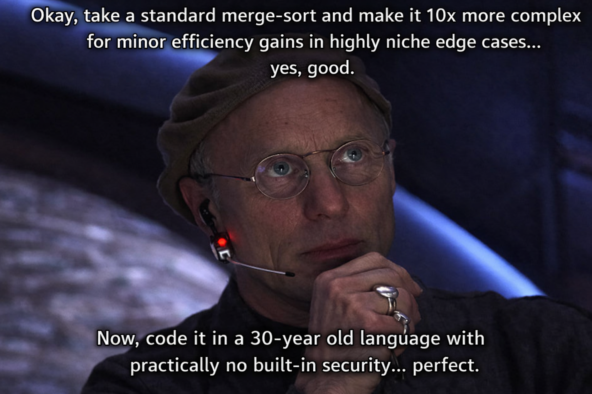

# CPP ++PlusPlus ✚➕

A leap into the modern (1998) world of object oriented programming...

 

## So, what is this project(s) all about?

This series of C++ exercises is sort of like a piscine/bootcamp style introduction to C++ 98 and the concept of objects. The... objective... here is to get familiar with all the 'new' concepts that weren't present in base C, resulting in an... objectively... fairly solid understanding of the low-level functionality of the the two types of languages.

 

## Objectifying C:

_The progression through the various modules is laid out below_:

 

**Module 00:** C++ basics and specifiv syntax, classes, I/O and build workflow

**Module 01:** Canonical class form – constructors, destructors, copy/move semantics

**Module 02:** Ad-hoc polymorphism, operator overloading and basic stream I/O

**Module 03:** Deeper inheritance, derived and abstract base classes, access control

**Module 04:** Exception safety, custom error types, interfaces

**Module 05:** Function templates, throws and catches, exceptions

**Module 06:** Advanced casting (reinterpretation, type qualifiers, up-and-down casts), heirarchy

**Module 07:** Templated classes, implicit vs explicit instanciation

**Module 08:** STL - functors, container types, smart pointers

**Module 09:** Advanced STL, concurrency, container-based algorithms, maps, deques, etc

 

While the early projects cover the basics, the complexity ramps up through the series and ultimately culminates in 'mini' projects involving algorithmic map lookups, a stack-based reverse polish notation calculator and a ground-up, full implementation of the little-known "Ford Johnson" merge-sort algorithm: a highly specific, partly recursive algo optimised for minimal comparisons of relative objects before sorting by pre-empting removals and insertions on the pend and main chains with a natively-generated sequence of 'Jacobsthal' numbers, running concurrently across multiple STL containers. Always a fan-favourite at parties...

 

 

_Objective achieved!_ _Feel free to peruse and poke around, feedback always welcome!_
